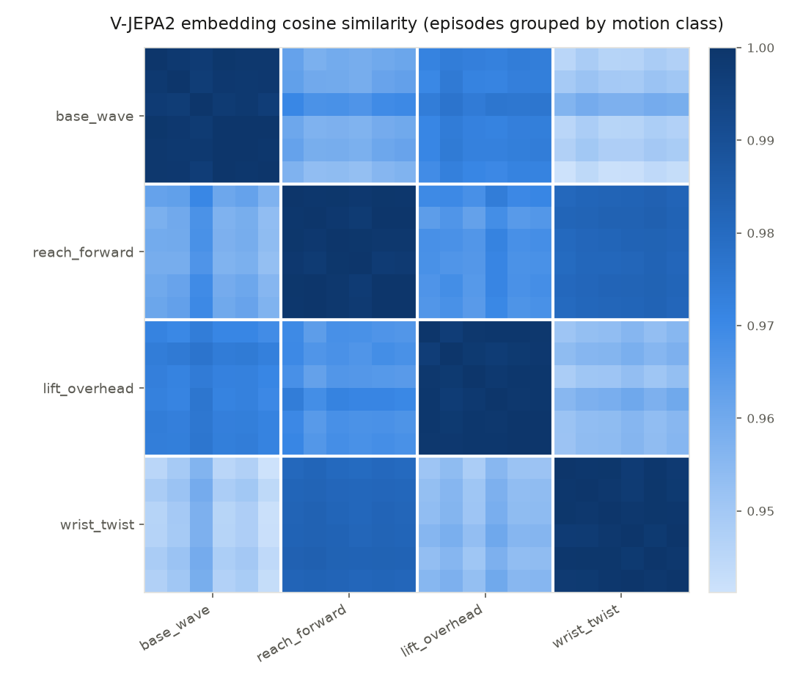
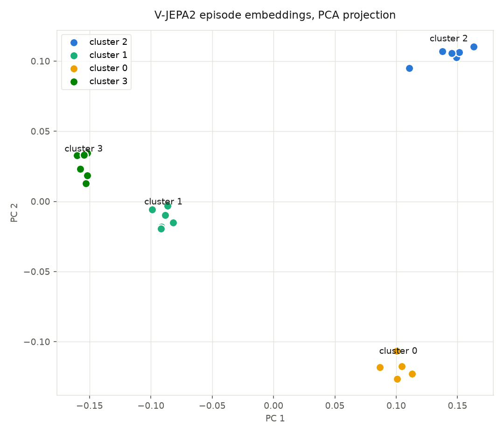
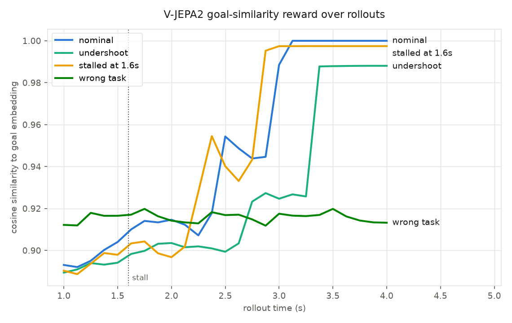

# jepa-drake-arm

Experiments combining [Drake](https://drake.mit.edu) robotics simulation with
Meta's [V-JEPA2](https://ai.meta.com/vjepa/) video world model.

A KUKA iiwa14 (bundled with Drake's model package) is simulated executing four
distinct joint-space motion classes. An `RgbdSensor` films each episode, the
rendered videos are embedded with the V-JEPA2 encoder
(`facebook/vjepa2-vitg-fpc64-384` — ViT-giant at 384px — via HuggingFace
transformers; every script takes `--model` to switch, e.g. to the ~3x-faster
`facebook/vjepa2-vitl-fpc64-256`), and the experiment verifies the model
"works as intended": episodes of the same motion embed close together and
different motions embed apart, measured with leave-one-out 1-NN accuracy,
within/between-class cosine similarity, and a silhouette score.

## Setup

This is a [uv](https://docs.astral.sh/uv/) project (`pyproject.toml` +
`uv.lock`):

```bash
uv sync
```

First run downloads Drake's model assets (~100 MB) and the V-JEPA2 checkpoint
(~1.2 GB) automatically.

## Run

```bash
# quick checks
uv run scripts/smoke_sim.py
uv run scripts/smoke_model.py

uv run scripts/run_experiment.py
# reuse already-rendered videos:
uv run scripts/run_experiment.py --skip-sim

# side-by-side videos (sim | what V-JEPA2 sees [PCA])
uv run scripts/side_by_side.py

# label-free perception demo: K-means clustering from jepa output
uv run scripts/unsupervised_perception.py

uv run scripts/reward_signal.py
```

Artifacts land in `output/`: per-episode MP4s, `embeddings.npz`,
`results.json`, `similarity_matrix.png`, `pca_scatter.png`.

## Workings

- **Motions** (`motions.py`): `base_wave`, `reach_forward`, `lift_overhead`,
  `wrist_twist`, each a q(t) with per-episode randomized amplitude,
  frequency, phase, and home-pose offset.

- **Embedding** (`embedder.py`): frames are uniformly resampled to the model's
  clip length (64), preprocessed by `AutoVideoProcessor` (resize to the
  model's crop, 384px), encoded by `VJEPA2Model.get_vision_features`,
  mean-pooled over patch tokens, and L2-normalized.

- **Evaluation** (`evaluate.py`): cosine similarity matrix ordered by class,
  leave-one-out 1-NN classification accuracy (chance = 25%), and a 2-D PCA
  scatter. High accuracy + within-class -> between-class similarity is the
  evidence that V-JEPA2 extracts meaningful motion structure from the sim.
  

- **Perception without labels** (`unsupervised.py`): the strongest form of
  the claim. K-means over the episode embeddings with k chosen by silhouette
  score discovers that there are exactly 4 motion types (k=4 wins), clusters
  them perfectly (adjusted Rand index 1.0 vs ground truth, revealed only
  post-hoc), and each cluster medoid retrieves only its own motion class.
  


- **Reward / progress signal** (`reward.py`): the RL recipe. One reference
  episode of a reach-and-hold task defines a goal embedding (its final 1 s
  window); test rollouts are scored by r(t) = cosine(embed(last 1 s), goal).
  The nominal rollout's reward rises near-monotonically (Spearman 0.92) to
  1.0, a mid-task stall converges below it, a weak reach plateaus a bit lower.
  The wrong motion stays flat at the bottom,  a dense, correctly-ranked shaping
  signal derived from a single demonstration video, no reward tuning.
  Caveat: raw cosine sits in a narrow band (~0.85-1.0) because the embedding
  space is anisotropic; RL use would normalize per-task (e.g. against the
  start-state similarity).
  

- **Side-by-side** (`visualize.py`): V-JEPA2 predicts in latent space, not
  pixels, so "what the model sees" is rendered from its patch tokens. Raw
  final-layer tokens are dominated by positional/global-attention structure,
  so the visualization uses an intermediate encoder layer (default 8) and each
  patch's deviation from its own temporal mean.
  * Brightness = motion energy
  * Color = PCA of the deviation<\b>

  


